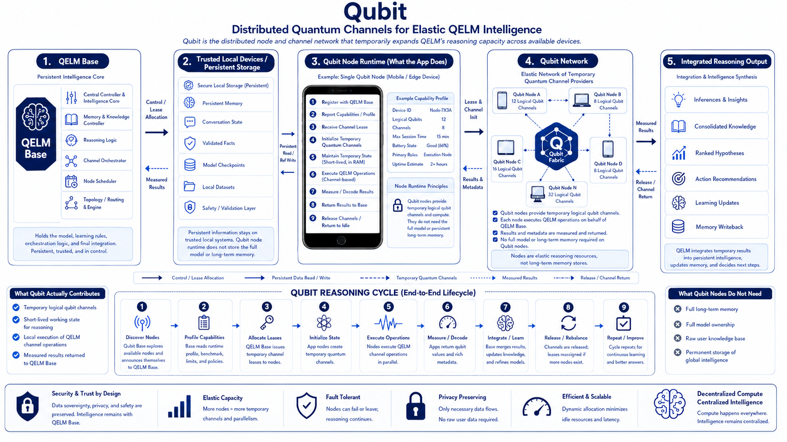

<div align="center">

[](https://discord.gg/sr9QBj3k36)

# Qubit

## Distributed Quantum Channels for Elastic QELM Intelligence

[](LICENSE)




**Qubit is the distributed node and channel network that temporarily expands QELM’s reasoning capacity across available devices.**

</div>

---

## Overview

**Qubit** is evolving from a standalone quantum logic toolkit into the distributed quantum-channel layer for **QELM**.

The original repository focused on two core quantum logic classes:

* **HybridQubit** (`Qubit.py`): Qiskit/Aer-backed statevector quantum logic.
* **Cubit** (`Cubit.py`): Pure NumPy CPU-based logical qubit simulation.

Those classes remain part of the repository, but they now represent the **foundation layer** of a larger direction: using ordinary devices as temporary QELM-controlled quantum channel nodes.

The new direction for Qubit is a distributed node and channel system where available devices can temporarily contribute logical qubit channels to QELM. QELM Base holds the persistent intelligence, memory, model logic, orchestration, and learning rules. Qubit nodes provide short-lived working channels for reasoning, computation, measurement, and return of results.

In simple terms:

> **Qubit lets QELM temporarily expand its reasoning capacity across available devices by leasing logical qubit channels from Qubit nodes.**

---

## Table of Contents

1. [Current Direction: Qubit Network](#current-direction-qubit-network)
2. [How Qubit Fits QELM](#how-qubit-fits-qelm)
3. [Foundation Modules](#foundation-modules)

   * [HybridQubit](#hybridqubit-qiskitaer-foundation)
   * [Cubit](#cubit-pure-cpu-foundation)
4. [Features](#features)
5. [Installation & Requirements](#installation--requirements)
6. [Usage: Getting Started](#usage-getting-started)

   * [HybridQubit Qiskit/Aer Mode](#hybridqubit-qiskitaer-mode)
   * [Cubit Pure CPU Mode](#cubit-pure-cpu-mode)
7. [Class Interface & Methods](#class-interface--methods)
8. [Advanced Techniques](#advanced-techniques)
9. [Planned Direction](#planned-direction)
10. [Troubleshooting & Common Pitfalls](#troubleshooting--common-pitfalls)
11. [Contributing](#contributing)
12. [License](#license)

---

## Current Direction: Qubit Network

The new Qubit architecture is based on **distributed temporary quantum channels**.

A Qubit node may be a phone, tablet, laptop, workstation, server, or other available device. That node does not need to hold the full QELM model, full memory, or permanent intelligence. Instead, it contributes temporary logical qubit channels that QELM can use while reasoning.

A Qubit node can:

* Register with QELM Base.
* Report its capability profile.
* Receive a temporary channel lease.
* Initialize logical qubit channels.
* Maintain short-lived quantum channel state.
* Execute QELM channel operations.
* Measure or decode results.
* Return results and metadata to QELM Base.
* Release the channel lease and return to idle.

The goal is to create an elastic reasoning layer:

```text
QELM Base
    ↓
Allocates temporary channel leases
    ↓
Qubit Nodes provide logical qubit channels
    ↓
Nodes execute QELM-assigned operations
    ↓
Measured results return to QELM Base
    ↓
QELM integrates, learns, updates, and releases nodes
```

This makes Qubit more than a local simulation toolkit. It becomes the distributed quantum-channel fabric that allows QELM to expand its working reasoning space when more devices are available.

---

## How Qubit Fits QELM

QELM is the persistent intelligence layer.

Qubit is the temporary channel layer.

The relationship is:

* **QELM Base** holds the model, learning logic, memory, orchestration, reasoning structure, and final integration.
* **Trusted local devices** hold persistent memory, datasets, checkpoints, validated facts, and conversation state.
* **Qubit nodes** provide temporary logical qubit channels and short-lived working state.
* **Qubit Network** allows those temporary channels to be discovered, leased, used, measured, released, and rebalanced.

The intended model is:

```text
Persistent intelligence stays with QELM.
Persistent knowledge stays on trusted local systems.
Temporary reasoning capacity comes from Qubit nodes.
```

Qubit nodes act like temporary computational neurons or quantum-channel resources. They do not need to permanently store the intelligence. They only need to provide temporary channel state and execute the operations assigned by QELM.

---

## Foundation Modules

The original `HybridQubit` and `Cubit` classes are still included and remain useful. They should now be understood as the **original foundation modules** for the broader Qubit direction.

They are not being removed. They are the local quantum-logic layer that the future distributed system builds on.

The earlier class-focused direction is now somewhat outdated compared to the larger goal of Qubit as a distributed QELM channel network, but the classes remain important because they provide the local simulation and logical-state behavior needed for future Qubit nodes.

---

### HybridQubit Qiskit/Aer Foundation

**HybridQubit** is the Qiskit/Aer-backed implementation.

It supports:

* Statevector-level quantum logic.
* Logical subspaces.
* Engineered noise.
* Amplitude storage and retrieval.
* Custom unitary operations.
* Qiskit/Aer simulation workflows.

This module is useful when Qiskit/Aer fidelity, circuit compatibility, or simulator-backed behavior is desired.

---

### Cubit Pure CPU Foundation

**Cubit** is the pure NumPy implementation.

It supports:

* CPU-only logical qubit operations.
* Direct statevector manipulation.
* Logical `|0⟩` and `|1⟩` subspace selection.
* Superposition, noise, and measurement logic.
* QPU-independent quantum simulation.
* AI/ML and QELM integration without Qiskit dependencies.

This module is especially important for the Qubit node direction because ordinary devices can run CPU-based Qubit logic without needing Qiskit or physical quantum hardware.

---

## Features

Current foundation features include:

* **Arbitrary-Dimensional Qubits**
  Work with standard qubits or extend into higher-dimensional logical systems.

* **Logical Subspace Selection**
  Assign any basis states to act as logical `|0⟩` and `|1⟩`.

* **Amplitude Storage and Retrieval**
  Move and recover information between logical and hidden subspaces.

* **Noise and Decoherence Models**
  Apply phase noise, depolarizing noise, amplitude damping, and related behavior.

* **Logical Operations**
  Apply logical X, Z, Hadamard, Rx, Ry, Rz, custom unitaries, and measurement routines.

* **Flexible Backends**
  Use Qiskit/Aer through `HybridQubit` or pure CPU NumPy simulation through `Cubit`.

Planned Qubit Network features include:

* **Qubit Node Runtime**
* **Temporary Channel Leasing**
* **Node Capability Profiles**
* **Distributed Logical Qubit Channels**
* **QELM-Controlled Channel Operations**
* **Measured Result Return**
* **Fault-Tolerant Node Rebalancing**
* **Privacy-Preserving Execution**
* **Elastic Reasoning Capacity**

---

## Installation & Requirements

**HybridQubit:** Python 3.7+, Qiskit, NumPy
**Cubit:** Python 3.7+, NumPy

```bash
pip install qiskit numpy
# For Cubit only:
pip install numpy
```

Clone the repository:

```bash
git clone https://github.com/R-D-BioTech-Alaska/Qubit.git
cd Qubit
```

---

## Usage: Getting Started

The current foundation classes offer a simple interface for local quantum logic.

---

### HybridQubit Qiskit/Aer Mode

Uses Qiskit’s simulator for quantum state fidelity, with Qiskit features available.

```python
from Qubit import HybridQubit

qubit = HybridQubit(dimension=4, logical_zero_idx=0, logical_one_idx=1, name="DemoHybrid")
print("Initial state:", qubit.get_statevector())

qubit.apply_logical_x()
print("After X:", qubit.get_statevector())

qubit.store_amplitude_in_subspace(target_subspace_idx=2)
qubit.retrieve_amplitude_from_subspace(source_subspace_idx=2)
qubit.apply_noise_to_subspace(gamma=0.05)

result = qubit.measure_logical()
print("Logical measurement:", result)
```

---

### Cubit Pure CPU Mode

All quantum logic runs directly on CPU. No external dependencies beyond NumPy.

```python
from Cubit import Cubit

cubit = Cubit(dimension=4, logical_zero_idx=0, logical_one_idx=1, name="DemoCubit")
print("Initial state:", cubit.state)

cubit.apply_logical_x()
print("After X:", cubit.state)

cubit.store_amplitude_in_subspace(2)
cubit.retrieve_amplitude_from_subspace(2)
cubit.apply_phase_noise(gamma=0.03)

result = cubit.measure_logical()
print("Logical measurement:", result)
```

---

## Class Interface & Methods

Both classes expose similar method sets for logical and subspace quantum operations:

* Statevector access: `.get_statevector()` or `.state`
* Logical operations: `.apply_logical_x()`, `.apply_logical_z()`, `.apply_h()`, `.apply_rx()`, and related methods
* Subspace manipulation: `.store_amplitude_in_subspace()`, `.retrieve_amplitude_from_subspace()`
* Noise models: `.apply_noise_to_subspace()`, `.apply_phase_noise()`, `.apply_amplitude_damping()`, `.apply_depolarizing()`
* Measurement: `.measure_logical()`, `.measure_full()`, `.measure_multiple_shots()`

See each class file for full implementation details.

---

## Advanced Techniques

Qubit supports experiments beyond basic qubit operations:

* **Qudit Experiments**
  Use higher dimensions for advanced simulation, error models, or logical redundancy.

* **Logical Subspaces**
  Store, retrieve, protect, or transform information across hidden or auxiliary state spaces.

* **Classical-Quantum AI**
  Use Cubit with QELM or related AI systems to support quantum logic without requiring physical quantum hardware.

* **Noise Calibration**
  Simulate hardware-like conditions by calibrating Cubit or HybridQubit noise behavior.

* **Distributed Channel Research**
  Extend local quantum logic into temporary remote channel execution for QELM reasoning.

---

## Planned Direction

The next major direction for this repository is the **Qubit Node Runtime**.

Planned components include:

### Qubit Node

A device-side runtime that can:

* Register with QELM Base.
* Report available logical qubit channels.
* Accept temporary channel leases.
* Initialize temporary channel state.
* Execute assigned QELM operations.
* Return measured or decoded results.
* Release channels when complete.

### Qubit Network

A distributed layer of Qubit nodes that can:

* Expand QELM’s temporary reasoning capacity.
* Provide parallel logical qubit channels.
* Join and leave dynamically.
* Support fault-tolerant reassignment.
* Avoid storing long-term memory or the full QELM model.

### Qubit Fabric

The temporary channel structure assembled by QELM from available Qubit nodes.

The fabric may include:

* Channel groups
* Temporary registers
* Parallel reasoning branches
* Measurement batches
* QELM-assigned logical operations
* Short-lived state used only during reasoning

### QELM Integration

QELM Base would remain the persistent controller.

It would:

* Discover available Qubit nodes.
* Allocate temporary channel leases.
* Route QELM channel operations.
* Receive measured results and metadata.
* Integrate results into reasoning and memory.
* Release or rebalance nodes as needed.

---

## Troubleshooting & Common Pitfalls

* **Dependencies**
  HybridQubit requires Qiskit and NumPy. Cubit requires only NumPy.

* **Indices and Dimensions**
  Basis state, logical, and subspace indices are checked for safety. Invalid choices raise errors.

* **Normalization**
  State normalization is handled automatically after operations.

* **Direct State Access**
  HybridQubit uses Qiskit-backed statevectors. Cubit uses direct NumPy arrays for speed and transparency.

* **Current vs. Future Direction**
  The current codebase contains the original local quantum logic classes. The distributed Qubit node architecture is the forward direction and may be added incrementally.

---

## Contributing

Fork, branch, and open a pull request. Issues and feature requests are welcome.

Areas of interest include:

* Multi-qubit support
* Qubit node runtime
* Distributed channel leasing
* QELM integration
* CPU and GPU simulation backends
* Fault-tolerant node scheduling
* Privacy-preserving node execution
* Improved documentation and examples

---

## License

MIT License. See [LICENSE](LICENSE).
